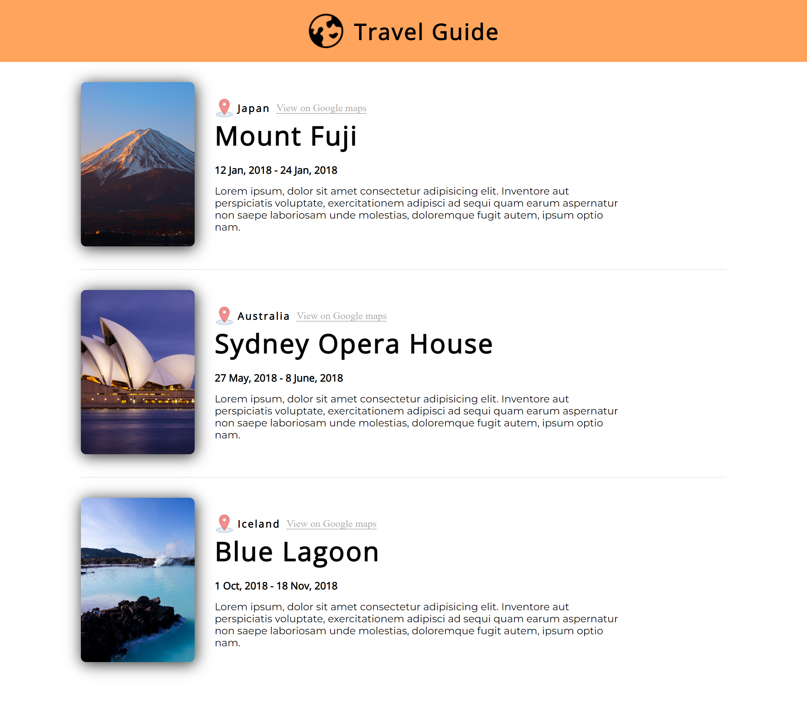

# Travel Guide

## Table of Content

 * [Overview of the Project](#overview-of-the-project)
 * [Challenges](#challenges)
      * [Screenshot](#screenshot)
 * [Technologies I Used](#technologies-i-used)
 * [What I Learned](#what-i-learned)

# Overview of the Project
This Project is a travel Journal to save your favorite destination places. This Project is made with React using the concept called Props and is responsive.

## Challenges
* The Challenge I faced with this project is showing images after deploying the project. When I deployed the project images were not visible as I was using saved images   in my public folder and react does not read properties which are placed in public folder and it remains untouched in the build folder. 

  To solve this problem I used Url of each image which I want to display which works perfectly fine.

## Screenshot

## Technologies I Used

* React

## What I Learned
* Learned about JSX.
* Learned What are props and how to create props.
* Learned about .map method.
* Learned How to pass props in object.
